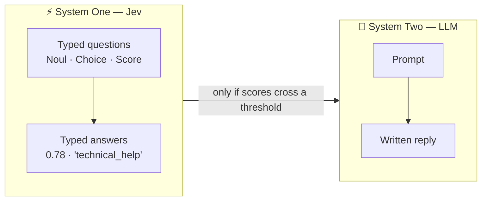
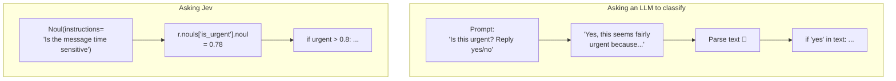
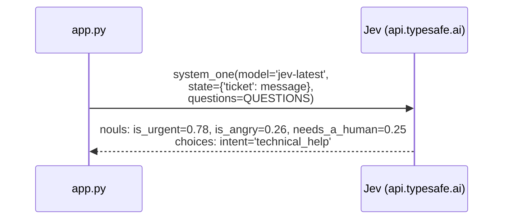
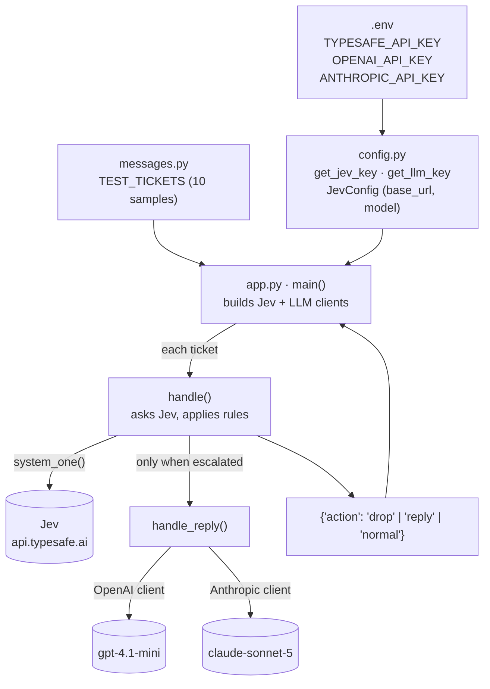
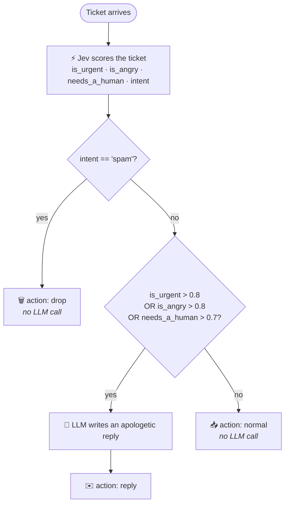
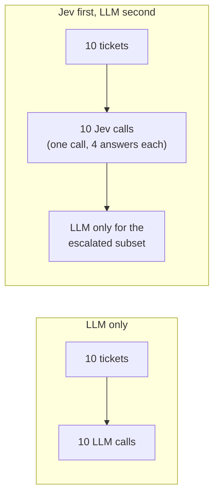
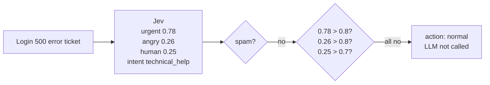
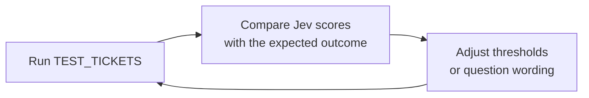

# code_2 — Fast decisions with Jev, slow thinking with an LLM

This folder is a small support-ticket triage pipeline. Every incoming ticket is first
judged by **Jev** (TypeSafe's *System One* model), which returns numbers and labels
in a single call. Plain Python `if` statements then decide whether the ticket is
worth a **second pass** by a general LLM (OpenAI or Anthropic) that writes a reply.

> **The idea in one line:** Jev decides, the LLM writes, and the LLM is only called
> when Jev's scores say it's worth it.

---

## Table of contents

1. [System One vs System Two](#system-one-vs-system-two)
2. [How Jev differs from an LLM](#how-jev-differs-from-an-llm)
3. [Architecture of code_2](#architecture-of-code_2)
4. [The decision logic](#the-decision-logic)
5. [One ticket, step by step](#one-ticket-step-by-step)
6. [File guide](#file-guide)
7. [Running it](#running-it)
8. [Tuning and next steps](#tuning-and-next-steps)

---

## System One vs System Two

The naming comes from the "two systems" model of thinking:

| | **System One — Jev** | **System Two — LLM** |
|---|---|---|
| Job | Judge / classify / score | Reason / write / explain |
| Output | Typed values: probabilities, labels, scores | Free text |
| Runs on | **Every** ticket | Only tickets Jev flags |
| Result you act on | A number you can compare with a threshold | Text you send to a person |



---

## How Jev differs from an LLM

An LLM answers in text, so its answer must be parsed, and "how sure are you?" has
no reliable numeric answer. Jev is called with **typed questions** and returns
**typed answers**, so its output drops straight into code.



### Jev's question types (primitives)

| Primitive | Question it answers | Answer accessor | Example in `app.py` |
|---|---|---|---|
| `Noul` | "How likely is this true?" | `r.nouls[name].noul` → float 0–1 | `is_urgent`, `is_angry`, `needs_a_human` |
| `Choice` | "Which of these labels fits best?" | `r.choices[name].choice` → str | `intent` (refund / technical_help / spam / other) |
| `Score` | "Rate this on a scale" | `r.scores[name]` | *(not used yet)* |

All questions go in **one** `system_one(...)` call, so four judgements cost one
round trip:



---

## Architecture of code_2



`main()` currently builds an **OpenAI** client. `handle_reply()` checks the client
type with `isinstance`, so switching to Anthropic only needs a change in `main()`:

```python
llm = Anthropic(api_key=get_llm_key(LLM_TYPE.ANTHROPIC))
```

---

## The decision logic

This is the core of the project: the step where Jev's numbers decide whether the
LLM runs at all (`handle()` in `app.py`).



In code:

```python
if intent == 'spam':
    return {'action': 'drop'}

if urgent > 0.8 or angry > 0.8 or human > 0.7:
    return {'action': 'reply', 'reply': handle_reply(llm=llm, message=message)}

return {'action': 'normal'}
```

### Why not just send every ticket to the LLM?



- **Cost:** spam and routine tickets never reach the more expensive model.
- **Control:** the rules are thresholds you can read, test and change, not
  hidden inside a prompt.
- **Auditability:** every decision has the numbers behind it
  (`urgent=0.78 angry=0.26 human=0.25`), so you can log and review why a ticket
  was or wasn't escalated.
- **Separation of concerns:** Jev is good at judging, the LLM is good at writing,
  and each does only its own job.

---

## One ticket, step by step

A real run from this project:

```text
Hi, I'm unable to log into my account since this morning.
Every time I enter my password I get a 500 error.
============
urgent=0.78 angry=0.26 human=0.25
intent='technical_help'
```



The ticket is urgent-ish (0.78) but just below the 0.8 threshold, so it is **not**
escalated. This is the kind of case where tuning matters; see below.

---

## File guide

| File | What it does |
|---|---|
| `app.py` | `QUESTIONS` (what Jev is asked), `handle()` (Jev call + routing rules), `handle_reply()` (LLM second pass), `main()` (loops over test tickets) |
| `config.py` | Loads `.env`, returns API keys (`get_jev_key`, `get_llm_key(LLM_TYPE)`), and `JevConfig` with `base_url='https://api.typesafe.ai'`, `model='jev-latest'` |
| `messages.py` | `TEST_TICKETS`: 10 samples covering technical help, angry/urgent outage, small and large refunds, legal, threat, spam, general enquiry, frustrated-not-urgent, urgent-but-polite |

---

## Running it

1. Add the keys to `.env` in the project root:

   ```env
   TYPESAFE_API_KEY=...     # from typesafe.ai
   OPENAI_API_KEY=...       # used by main() today
   ANTHROPIC_API_KEY=...    # if you switch to Claude
   ```

2. Run from this folder (the imports are local, e.g. `from config import ...`):

   ```bash
   cd code_2
   uv run python app.py
   ```

Each ticket prints Jev's scores and intent; escalated tickets also print
`llm reply ...`.

---

## Tuning and next steps



- **Thresholds:** `0.8 / 0.8 / 0.7` are starting points. The login-error ticket at
  `urgent=0.78` suggests `0.75` may fit your data better.
- **Question wording:** Jev follows the `instructions` text, so sharper wording
  gives sharper scores (e.g. fix the typo in `'Is the mesasage time sensitive'`).
- **Use `intent` for routing:** send `refund` to billing and `technical_help` to
  engineering, and adjust the LLM's tone or context per intent.
- **The `normal` path does nothing yet:** it could get a cheaper LLM reply, an FAQ
  lookup, or be queued for a person.
- **Log decisions:** store ticket, scores, action and reply (e.g. SQLite) to tune
  thresholds from real data.
